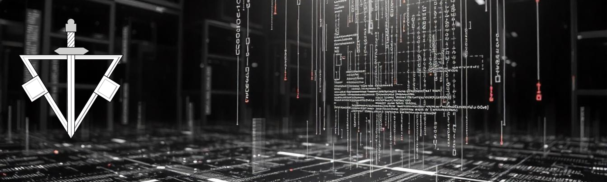

<h1 align="center">Hola, soy <a>Carlos Guevara</a> 👋</h1>

## Sobre mi
- 💻 Desarrollador Front-end Jr  👋
- Interfaces responsivas 📲
- Tecnologías📡 
- Aprendizaje constante 📊
 

## Tecnologías

  
  
  
  
  
  

## Habilidades Blandas

  
  
  
  
  
  
  
  
  
  
  
  
  

## Proyectos
<table>
<tr>
<td width="50%">
<h3 align="center">Recipe page Frontend Mentor</h3>

<!--
**Carlos-J-Guevara/Carlos-J-Guevara** is a ✨ _special_ ✨ repository because its `README.md` (this file) appears on your GitHub profile.

Here are some ideas to get you started:

- 🔭 I’m currently working on ...
- 🌱 I’m currently learning ...
- 👯 I’m looking to collaborate on ...
- 🤔 I’m looking for help with ...
- 💬 Ask me about ...
- 📫 How to reach me: ...
- 😄 Pronouns: ...
- ⚡ Fun fact: ...
-->
