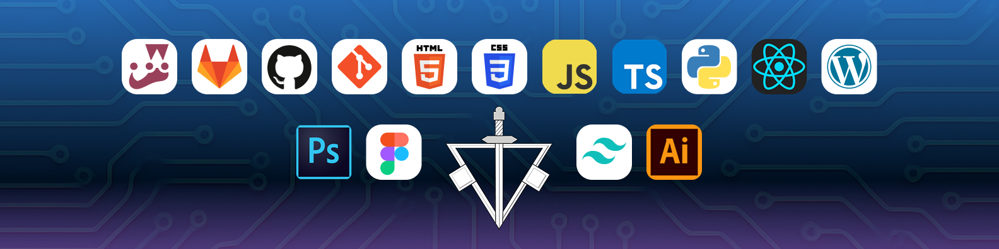

<h1 align="center">Hello, I'm <a>Carlos Guevara</a> 👋</h1>

## Contact
 

## About me
- 💻 Junior Front-end Developer  👋
- Responsive interfaces 📲
- Technologies📡 
- Continuous learning 📊

## Technologies

  
  
  
  
  
  

## Development tools, libraries and frameworks

 
   
   
   
   
   
   
   
   
   
   
   
  
  
  
  
  
  
  
  

## Soft skills

  
  
  
  
  
  
  
  
  
  
  
  
  

## Projects

<table>
  <tr>
    <td width="50%" align="center">
      
    </td>
    <td width="50%" align="center">
      
    </td>
  </tr>
</table>

#### ⚙️ &nbsp;GitHub Analytics

  <a href="https://github.com/Carlos-J-Guevara">
    

      
      
    

  </a>

<!--
**Carlos-J-Guevara/Carlos-J-Guevara** is a ✨ _special_ ✨ repository because its `README.md` (this file) appears on your GitHub profile.

Here are some ideas to get you started:

- 🔭 I’m currently working on ...
- 🌱 I’m currently learning ...
- 👯 I’m looking to collaborate on ...
- 🤔 I’m looking for help with ...
- 💬 Ask me about ...
- 📫 How to reach me: ...
- 😄 Pronouns: ...
- ⚡ Fun fact: ...
-->
